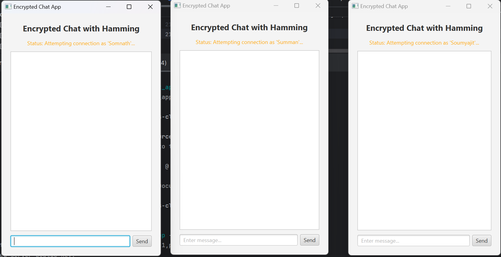

💬 JavaFX Encrypted Chat with Hamming(7,4) Error Correction
This is a basic client-server chat application built using JavaFX. It combines RSA encryption for secure messaging and Hamming(7,4) Error Correction Code (ECC) to detect and fix single-bit errors during transmission.

The goal of this project is to help you understand how encryption and error correction can work together in a real-time messaging system.

✨ Key Features
✅ Client-Server Chat – Connect to a server and chat with other users.

👥 Group & Private Messages – Send messages to everyone, or privately using @username.

🔐 RSA Encryption – Messages are encrypted on the client side using the server's public key and decrypted by the server using its private key.

🧠 Hamming(7,4) ECC – Adds error correction to the encrypted message, allowing the system to fix single-bit errors automatically.

🧪 Simulated Errors – A random 1-bit error is added on purpose to show how ECC fixes it.

🖼️ JavaFX User Interface – A simple and clean UI for sending and viewing messages.

📜 Message Details – Expand any message to view:

-Original text
-Encrypted data
-Hamming-encoded version
-Simulated error
-Error correction steps
-Final decrypted message

🛠️ Maven Build System – Uses Maven to handle building and running the project easily.

🛠 Technologies Used

-Java (JDK 17 or later)
-JavaFX
-Apache Maven
-Java Cryptography Architecture (JCA) for RSA
-Hamming(7,4) Error Correction Code

🚀 Getting Started : 
1. Clone the Project bash Copy Edit
   
git clone https://github.com/your-username/JavaFX-Encrypted-Chat-Hamming.git

cd JavaFX-Encrypted-Chat-Hamming

3. Build the Project bash Copy Edit :
  
- mvn clean compile
  
6. Start the Server bash Copy Edit :
   
-mvn clean compile exec:java(Leave this terminal open. The server is now running and ready to accept clients.)

8. Start a Client In a new terminal window, run: bash Copy Edit
   
-mvn clean javafx:run(A JavaFX window will open. Enter your username to join the chat.)

5. Add More Clients (Optional)
   
To test with more users, repeat step 4 in new terminal windows.

💬 How to Use
Type your message and press Enter or click the Send button.

To send a private message, use: bash Copy Edit 
-@username your message here(Click Show Details on any message to view:)

-Original Text
-Encrypted Data
-Hamming-Encoded Version
-Simulated Error
-Error Correction Steps
-Final Decrypted Message

📷 Screenshots
Screenshots of the UI and message details can be found in the screenshots/ folder.

